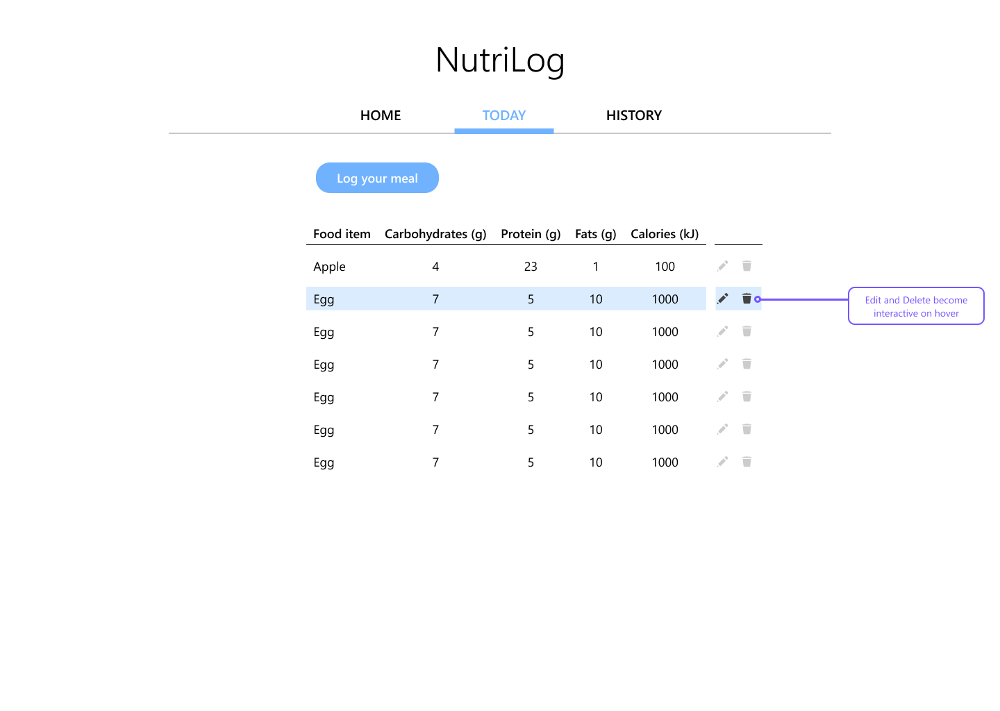

 

# NutriLog

This straightforward nutrition app was designed as a centralized place for users to keep track of their diet throughout the day. Users can create new items using a form, and edit or delete items from the Today page using the corresponding icons.

(((At the end of each day, meals are automatically archived on the History page where they can be retrieved for future reference)))
 

## Getting Around

Use the navigation bar at the top of the page to explore the Home, Today, and History pages.

 

## Technologies Implemented

| Backend          	| Frontend                               	|
|------------------	|----------------------------------------	|
| * node           	| * JavaScript, HTML, CSS, Markdown      	|
| * nodemon        	| * react, -router-dom, -scripts, -icons 	|
| * express        	| * axios                                	|
| * mongoose       	| * netlify                              	|
| * mongoDB, Atlas 	| * Microsoft Typography                 	|
| * Heroku         	|                                        	|
| * JavaScript     	|                                        	|

 

## Future Development

Initially, the developers for this site had planned for a more specific set of features focused on the items on a given day and ways to archive those items. Future features will include:

* Only items entered on the current day will populate the "today page".
* Calorie, fat, protein, and carb calculators to calculate the daily totals.
* A history page with links to each days' entries.
* Nutritional values that auto-fill when you begin typing the name of a food.
* "Meet the devs" section toward the bottom of the homepage.
* UX design like the wireframe below.

