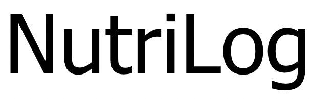
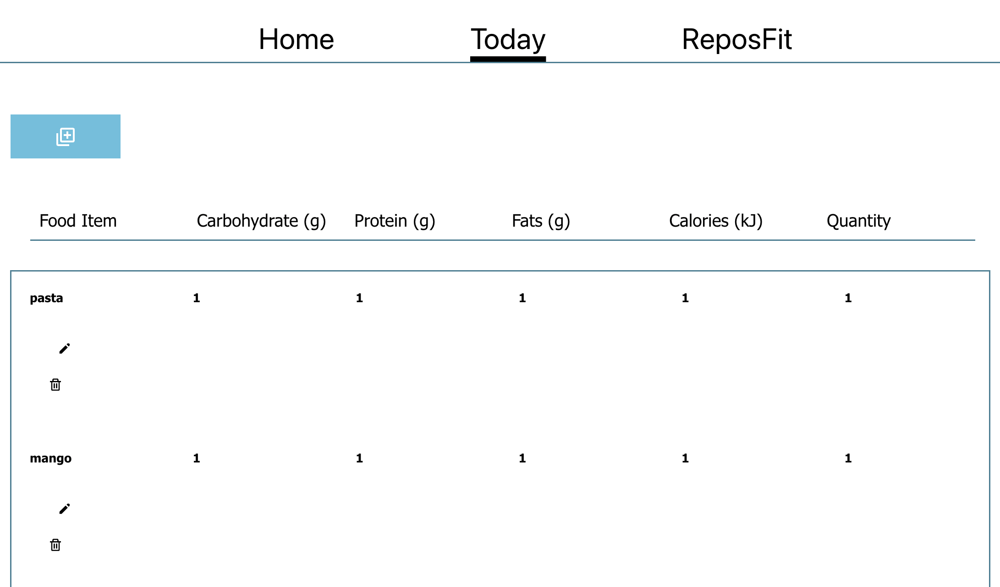
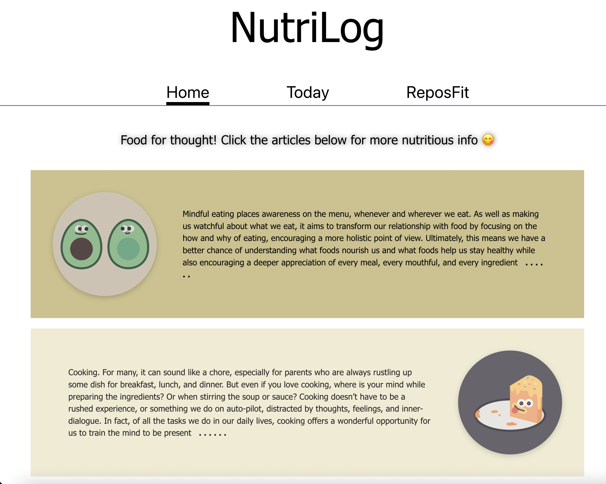
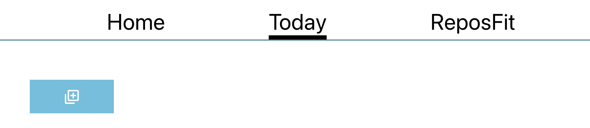

___________________________________________________

This straightforward nutrition app was designed as a centralized place for users to keep track of their diet throughout the day. Users can create new items using a form, and edit or delete items from the [Today page](https://nutrilogx.netlify.app/today) using the corresponding icons.

 

 

The [Home page](https://nutrilogx.netlify.app/) features links to articles and blog posts about nutrition, dieting, and mindfulness.

 

 

From our NavBar, we link to our peers' [ReposFit](https://reposfit.netlify.app/) site which is a logger and guide for exercise and weight lifting. Used together, both sites offer a powerful set of health tools.
 

## Getting Around

___________________________________________________
Use the navigation bar at the top of the page to explore the Home, Today, and ReposFit pages. Click on the blue button on the Today page to add a new meal and log its nutritional values.

The articles on the homepage are clickable and will open a new window to the article's origin website.

A new meal will appear in the grid below and can be edited or deleted using the pencil icon or trash can icon below the name of each meal.

 

## Backend Request Routes

 

GET ALL: https://nutritionx-app.herokuapp.com/items;

GET ONE: https://nutritionx-app.herokuapp.com/items/:id

POST: https://nutritionx-app.herokuapp.com/items;

UPDATE: https://nutritionx-app.herokuapp.com/items/:id

DELETE: https://nutritionx-app.herokuapp.com/items/:id

 

## Technologies Implemented

 

| Backend          	| Frontend                               	|
|------------------	|----------------------------------------	|
| * node           	| * JavaScript, HTML, CSS, Markdown      	|
| * nodemon        	| * react, -router-dom, -scripts, -icons 	|
| * express        	| * axios                                	|
| * mongoose       	| * netlify                              	|
| * mongoDB, Atlas 	| * Microsoft Typography                 	|
| * Heroku         	|                                        	|
| * JavaScript     	|                                        	|

 

## Our Team

 

[Samantha Delacruz](https://github.com/sdmantha)

 

[Jack Jiang](https://github.com/jjiang9888)

 

[Ron Lanzilotta](https://github.com/RonLanzilotta)

 

[Argurjana Olloni](https://github.com/argurjanaolloni)

 

[Jose Calderon](https://github.com/HowzayCalderon)

 

## Future Development

 

Initially, the developers for this site had designed for a way to store items to a specific day and recall each day on a History page. This and other features will be a part of a future build.

* Only items entered on the current day will populate the "today page".
* Calorie, fat, protein, and carb calculators to calculate the daily totals.
* A history page with links to each days' entries.
* Nutritional values that auto-fill when you begin typing the name of a food.
* "Meet the devs" section on the bottom of the homepage.
* UX design like the wireframe below.

 

